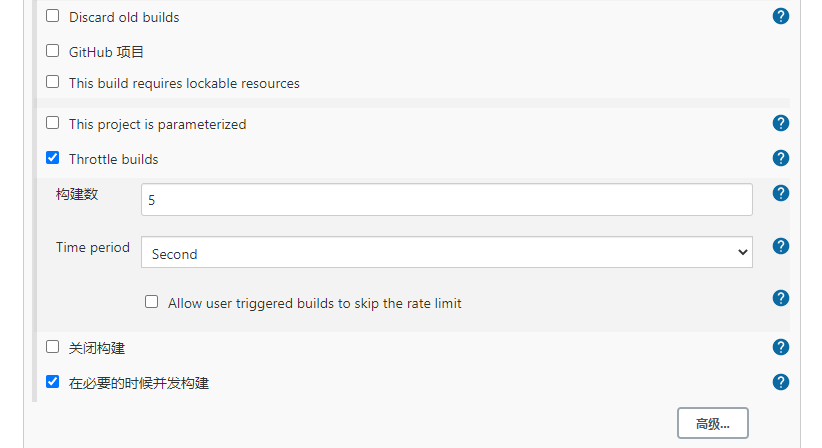
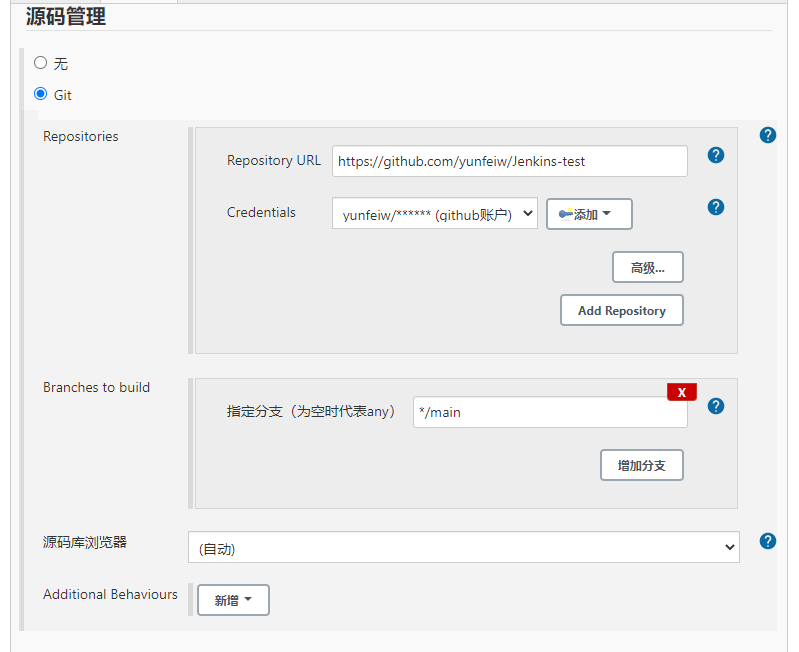
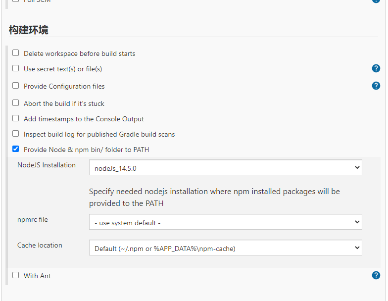

## Window下部署 jenkins 

### |安装

* [jenkins下载地址](https://www.jenkins.io/zh/download/) ;

* 安装时，采用默认配置即可;安装完成默认访问地址[http://loaclhost:8080](http://loaclhost:8080);

*  可更改workspace，防止其占用C盘空间。

    1. 更改前停止服务 【http://localhost:8080/exit/】
    
    2. "系统环境" 变量配置 JENKINS_HOME : path;

    3. 重启服务。jenkins安装包下， 运行 '  java -jar jenkins.war  '

### |插件

* init时选择默认插件即可。

* 构建不同流程的project，所需plugin也不尽相同。位置：Manage Jenkins -> Manage Plugins

* 前端任务构建时需要 NodeJs / Post build Task

* 安装完成后，需要配置NodeJs全局信息,便于在项目中使用。地址：Manage Jenkins -> Global Tool Configuration -> NodeJs

### |构建任务

* 新建任务时，前端任务类型为 Freestyle project

    步骤1
    
    
    
    步骤3
    
    
    
    步骤3
    

